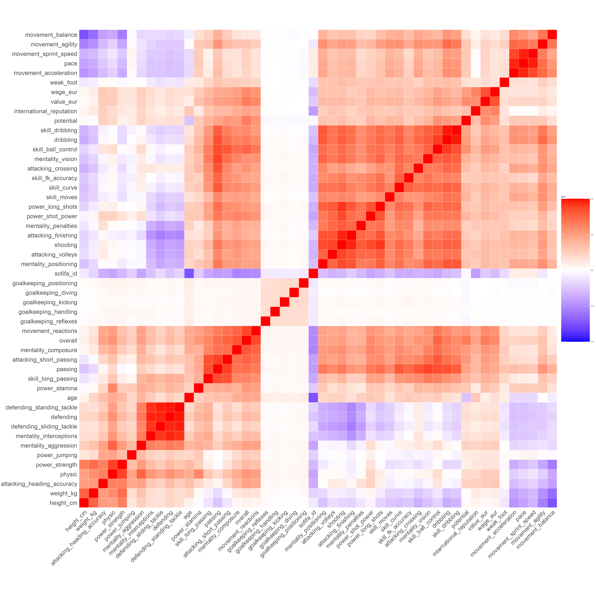

```{r setup, include=FALSE}
knitr::opts_chunk$set(echo = FALSE, fig.align="center")
options(warn = -1)
```
<style>
body {
text-align: justify}

h2 {
padding-left: 45px;
color: IndianRed
}

h5{
padding-left: 18px
}

h1.title {
  text-align: center;
  color: Navy
}
h4.author { 
  text-align: center;
}
h4.date { 
  text-align: center;
}
</style>

## Introduction 

Football is one of the most important sports in all the world. Events like the World Championship are very popular and have a huge resonance on the media. We are now approaching the European Championship, and now it is simple to feel the importance of this event. Looking for an interesting theme for our project we focused on two themes. The first comes from the consideration of the rising of the value of top tier players in the last decades. So we are interested in understanding if the value can be related to the ability of a player. By this mean, we will analyze a dataset looking for this relationship. With the best model found we will look the most overrated and underrated players indicated by the model. The practical side of this analysis spaces from a basic usage in the rising field of e-sports - like championships with budget constraints - to real field market considerations. The second theme is to create a statistical model which, starting from some statistics of the players, is able to model the results obtained in the last Serie A tournament. In this case, we are interested in the feasibility and in the prediction ability of the model. 

The whole project is principally based on a _Kaggle_ dataset that contains the statistics about football players in the famous videogame (<https://www.kaggle.com/stefanoleone992/fifa-21-complete-player-dataset>). The choice of the dataset was determined by its cheapness and by the presence of many statistics useful for the videogame but difficult to get in the real world. It is difficult to assign a value from 0 to 100 regarding different abilities like defending, ball control or crossing to all the players in the world. FIFA game is bound in defining this values for the game. We take them like fictitious and simulated but with a possible  usefulness in the real world. The only value strictly related to reality is the value of the players, which is taken from sites like <https://www.transfermarkt.it/uefa-champions-league/marktwerte/pokalwettbewerb/CL> at the release of the game. The choice of modeling the value based on the other "simulated" statistics is so a way to see if, in general, we can take them as valid for other analysis. For this reason, the main project is going to focus on modeling the value, while the match result model will be treated like a special application coming from some conclusions taken from the other one. The dataset used for the match result model was taken from <https://www.football-data.co.uk/italym.php>. In both the cases we used only data regarding the 2020/2021 championships.

## Initial data: Dataset and exploratory analysis 

To perform the analysis we start from looking at the dataset. This dataset does not require a lot of preprocessing in order to be used. Beforehand, certain variables with uncertain meaning has been removed (i.e. rb, rf, rw, etc.). Some other particular variables were removed like informations about loaning and images. All the records with at least one Not Available entry were removed. A last modification was to remove the goalkeepers because they do not share some variables with the other players so they would require a separate analysis. This preprocessing analysis is reported here in a inactive r code chunk.  

```{r}
#library(readr)
#rm(list=ls())
#setwd("C:/Users/Amministratore/Desktop/Università/Anno 2/Statistical Learning")
#df = read.csv("players_21.csv", 
#              header = T,
#              na.strings = c("NA", "NAN", "nan", "na"))

## ------------------------------------------------------------
## Dataset description
## ------------------------------------------------------------
#dim(df)
#str(df)
#summary(df)
#colnames(df)

## ------------------------------------------------------------
## Select only usefull variables
## ------------------------------------------------------------
#delete_columns= c("player_url", 
#                  "long_name", 
#                  "dob",
#                  "body_type", 
#                  "real_face", 
#                  "release_clause_eur",
#                  "player_tags", 
#                  "team_jersey_number",
#                  "loaned_from", 
#                  "joined", 
#                  "contract_valid_until", 
#                  "nation_position",
#                  "nation_jersey_number", 
#                  "player_traits",
#                  "defending_marking")
#df_new = df[, !names(df) %in% delete_columns] 
#df_new = df_new[,-c(66:91)]

## ------------------------------------------------------------
## Find na values in the dataset and omit them
## ------------------------------------------------------------
#df_gk = df_new[df$player_positions=="GK",]
#df_pl = df_new[df_new$player_positions!="GK",]

#sum.is.na = function(vector){
#  sum(is.na(vector))
#}

#apply(df_gk, 2, sum.is.na)
#df_gk = na.omit(df_gk[,-c(21:26)])
#apply(df_gk, 2, sum.is.na)

#apply(df_pl, 2, sum.is.na)
#df_pl = na.omit(df_pl[,-c(27:32)])
#apply(df_pl, 2, sum.is.na)

## ------------------------------------------------------------
## Remove last 0 components
## ------------------------------------------------------------
#df_gk[df_gk$value_eur == 0, "short_name"] = NA
#df_gk = na.omit(df_gk)

#df_pl[df_pl$value_eur == 0, "short_name"] = NA
#df_pl = na.omit(df_pl)

## ------------------------------------------------------------
## New dataset in output
## ------------------------------------------------------------
#write_csv(df, file = "players_21_preproc_pl.csv")
#write_csv(df, file = "players_21_preproc_gk.csv")
```


Let's start with importing the dataset (encoding = UTF-8). We call it ***_df_*** and we take strings values as factors. We import it like a data frame and we look for its general structure. It is composed by `r nrow(df)` players and has `r ncol(df)` variables. It has no missing values as well as all the players included have a positive value for our interest variable ***_value_eur_***.

```{r}
setwd("C:\\Users\\vrsac\\Desktop\\SL")
df = read.csv("players_21_preproc_pl.csv", stringsAsFactors = T)
#df = read.csv(file.choose(), stringsAsFactors = T)
df <- data.frame(df)
#is.data.frame(df)
cat("Are there any NAs? ", any(is.na(df)))
cat("Number of players with invalid money value: ", sum(df$value_eur <= 0.0))
df = df[df$league_rank == 1,]
df = df[,-c(9)]
```

For our purposes, we are going to consider only those players who belongs to a top tier league. This reduces our entries to the number of `r nrow(df)`. A general idea of which variables are included and what type and values they can take can be seen in this frame.

```{r}
str(df)
```

There are 8 factor variables and 51 numeric variables. All the numeric variables are _integers_ and not _real_, and this is probably given to get a smaller memory needing for storage. Some factors are really big, taking up to 609 levels. 

Before starting visualizing our datas, let's just see which are the more and less valued players in the dataset.
```{r}
higher = sort(df$value_eur, decreasing = TRUE)[1:15]
lower = sort(df$value_eur, decreasing = FALSE)[1:15]
cbind(df[c(df$value_eur %in% higher),c(2,11)][1:15,],df[c(df$value_eur %in% lower),c(2,11)][1:15,])
```

We can see the huge difference between the most valued and the less valued. As said in the intro we are interested in knowing if this difference reflects even in the players' statistics and if the statistics themselfs can suggest which players are underrated or overrated. 

We now are going to perform a quick general analysis of the whole data frame in order to understand relationships and how to treat our data. We start with visualizing the histograms of the numeric variables.

```{r, echo=FALSE}
num_df = df[,unlist(lapply(df, is.numeric))]
png("istog.png", height = 10000, width = 10000, res=120, pointsize = 50)
par(mfrow=c(9,6))
for (i in 1:ncol(num_df)){
  hist(num_df[,i], xlab = NA, main = paste("Histogram of" , names(num_df)[i]), col = "lightblue")
}
dev.off()
```
```{r, echo=FALSE}
knitr::include_graphics("istog.png")
```

We see different distributions of variables. Some variabels seems to be normal, while others are concentrated in a small portion of values or are bimodal variables. For some variable of interest, we will look at their distribution later on.
Let's see how variables are correlated with an heatmap:

```{r}
library(ggcorrplot)
png("heatmap.png", height = 5000, width = 5000, res=120, pointsize = 100)
ggcorrplot(cor(num_df), hc.order = TRUE, outline.col = "white", tl.cex = 30)
dev.off()
```
```{r, echo=FALSE}

```

The heatmap shows that there are some groups of variables that seems to be positive correlated. For example, all the goalkeeper statistics form one group. There are many other subgroups that represents: phisical structure, defending, attacking and dribling, value and movement. Other groups are uncorrelated like phisical variables with the movement ones. 

From this brief analysis we have seen that there are some interesting variables and some other we want to get rid of. In our case we are going to exclude the ***_sofifa_id_***, that gives an unique id to a player in the game. For the analysis we exclude ***_short_name_***, ***_nationality_***, ***_club_name_*** because we are not interested in differences given by the team or by the nationality players play in. ***_league_rank_*** was set to a unique value so has been removed. Knowing we have only players who are not goalkeeper, we remove all the statistics related to that role: ***_goalkeeping_diving_***, ***_goalkeeping_handling_***, ***_goalkeeping_kicking_***, ***_goalkeeping_positioning_***, ***_goalkeeping_reflexes_***. To be fair and make a more interesting analysis we have decided to remove even the ***_wage_eur_*** variable, that is the more correlated with the ***_value_eur_*** one. This is done even to understand better the relationship between the value and the players' strenghts, more than taking into account other money value-attribution statistics. 

```{r}
df2 = df[,-c(1,2,6,7,12,58,57,56,55,54)]
```

In order to take into account the league difference around the world, we define a new qualitative variable ***_imp_leagues_*** from ***_league_name_*** that separates european teams versus the rest of the world. We know that in Europe are concentrated the most important players of the world and so this distinction can be really helpful. We then discard ***_imp_leagues_***.

```{r}
imp_leagues <- c("English Premier League", "French Ligue 1", "German 1. Bundesliga", "Holland Eredivisie", "Italian Serie A", "Portuguese Liga ZON SAGRES", "Russian Premier League", "Spain Primera Division")
df$imp_league <- as.factor(df$league_name %in% imp_leagues)
```

A last modification is to deal with the qualitative variables ***_player_positions_*** and ***_team_position_***. They are very similar and can take a huge amount of different values. To not discard this information completely, we are going to redefine the role of a player based on these and forming a variable ***_position_*** with values: attack, middle, defence, sub. The idea is that, for the value variable, it doesn't matter the precise role (i.e. right defensor vs left defensor), but only the general position in the football field.  

```{r out.width = '50%', fig.align="center"}
att <- c("LW","LF","CF","ST","RW","RF","LS","RS","LAM") # 9 attack positions
mid <- c("LM","CDM","CM","CAM","RM","RCM","LCM","LDM","RAM","RDM","RES") # 11 mid positions
def <- c("LB","LWB","RB","RWB","GK","LCB","RCB","CB") # 8 def positions

df$position = rep(NA,length(df[,1]))
for (i in 1:length(df[,1])){
  if (df$team_position[i] %in% att)
    df$position[i] <- "att"
  else if (df$team_position[i] %in% mid)
    df$position[i] <- "mid"
  else if (df$team_position[i] %in% def)
    df$position[i] <- "def"
  else
    df$position[i] <- "sub"
}
df2$position <- factor(df$position)
df2 = df2[,-c(4,8,14)]

pie(table(df2$position),
    col=rainbow(4),
    main="Player's Position Distribution")
```

The only qualitative variables not touched are ***_preferred_foot_*** (Left vs Right) and ***_working_rate_*** which has 9 levels.

As of the remaining variables we decided to select a few we thought could be the better guesses for the value attribution. This variables are: ***_age_***, ***_potential_***, ***_overall_*** and ***_international_reputation_***. We will analyze this explicative variables better, as well as perform a model of common sense to be compared to the final one. But first we are going to take a closer look to our interest variable: ***_value_eur_***. 
\
&nbsp;

##### ***Value:***
Value reports the amount of euros needed to buy a certain player. In our case we have decided to consider it with its usual value, but even with a logarithm (base 10) transformation. The transformation can help us achieve a better model, even if it does not provide us a normally distributed variable. By the first models we will decide which version to keep.

```{r fig.align="center"}
par(mfrow = c(2,2))
hist(df2$value_eur, col = "darkseagreen4", main="Players value distribution", xlab = "value")
qqnorm(df2$value_eur)
qqline(df2$value_eur)
hist(log10(df2$value_eur), col = "darkseagreen4", main="Players log10 value distribution", xlab = "log10(value)")
qqnorm(log10(df2$value_eur))
qqline(log10(df2$value_eur))
par(mfrow=c(1,1))
```

##### ***Potential:***
Is the value that tells about the possibility of growth proved by the player. It is a way of taking into account the possible increase of the ability of a certain player. From the plots we can see the distribution and the effect on the value variable: 

```{r fig.align="center"}
par(mfrow = c(2,2))
hist(df2$potential, col = "indianred3", main = "Distribution of potential", xlab = "potential")
boxplot(df2$potential, col = "indianred3", main = "Boxplot of potential")
plot(df2$potential,df2$value_eur, xlab = "potential", ylab = "value", main = "value | potential")
plot(df2$potential,log10(df2$value_eur), xlab = "potential", ylab = "log10(value)", main = "log10(value) | potential")
par(mfrow = c(1,1))
```

##### ***Overall:***
Is a general value that should represent the _overall_ ability of the player. It should resume all the others variables. The distribution and relation with the value are shown under.

```{r fig.align="center"}
par(mfrow = c(2,2))
hist(df2$overall, col = "wheat", main = "Distribution of overall", xlab = "overall")
boxplot(df2$overall, col = "wheat", main = "Boxplot of overall")
plot(df2$overall,df2$value_eur, xlab = "overall", ylab = "value", main = "value | overall")
plot(df2$overall,log10(df2$value_eur), xlab = "overall", ylab = "log10(value)", main = "log10(value) | overall")
par(mfrow = c(1,1))
```

From this variable we have decided to define a new one called ***_category_***. This is a categorical variable meant to distinguish various categories of overall ability and can be useful to group players with a similar total ability. 

```{r fig.align="center", out.width='50%'}
df2$category <- as.factor(cut(df$overall,breaks=c(0,49,69,79,87,100),labels=c("iron","bronze","silver","gold","elite"),right = T))
barplot(table(df2$category),
    col=rainbow(4),
    main="Player's Category Distribution")
```

##### ***International Reputation:***
Is a discrete ordered value between 1 and 5 that is meant to show how much famous and known is a certain player. We expect it to be correlated with the value:

```{r fig.align="center"}
par(mfrow = c(2,2))
hist(df2$international_reputation, col = "lightblue", main = "Distribution of Intetrnational Reputation", xlab = "international reputation")
boxplot(df2$international_reputation, col = "lightblue", main = "Boxplot of International Reputation")
plot(df2$international_reputation,df2$value_eur, main = "value | international reputation", xlab = "international reputation", ylab = "value")
plot(df2$international_reputation,log10(df2$value_eur), main = "log10(value) | international reputation", xlab = "international reputation", ylab = "log10(value)")
par(mfrow = c(1,1))
```

##### ***Age:***
Is a discrete value that tells how old is a certain player. We expect the value to increase as the player is in the middle of his career, and then it should start decreasing.

```{r fig.align="center"}
par(mfrow = c(2,2))
hist(df2$age, col = "goldenrod1", main = "Distribution of age", xlab = "age")
boxplot(df2$age, col = "goldenrod1", main = "Boxplot of age")
plot(df2$age,df2$value_eur, main = "value | age", xlab = "age", ylab = "value")
plot(df2$age,log10(df2$value_eur), main = "log10(value) | age", xlab = "age", ylab = "log10(value)")
par(mfrow = c(1,1))
```

In order to represent in a better and simplier way the relation we described between value and age, we decided to redefine _age_ in terms of career phase. We now create a new variable ***_phase_*** that divides the ages in 5 categories of career phase: "young", "prime", "old", "near_retirement", "last_year".

```{r fig.align="center", out.width='50%'}
df2$phase <- factor(cut(df2$age, breaks = c(15,20,32,35,38,40),right = TRUE, labels = c("young","prime","old","near_retirement","last_year")))
plot(df2$phase, col = rainbow(5), main = "Players' Phase Distribution", xlab = "phase")
```
```{r}
names <- df[,2]
selected_df = df2
#detach(selected_df)
attach(selected_df)
```

From this variables plots, it can be seen that the logarithmic transformation of the value variable provides a better linear relationship with all the others. It is a first sign on the direction of choosing the transformed version of the variable.

Before leaving the exploratory analysis, we perform a last control over the qualitative variables. In order to get a good model without including a lot of dummies, we look for the potential significance of the qualitative variables. We have already discarded or transformed the ones which had the greater amount of factors. Most of our concern is about the multifactorial remained. By the ANOVA test and the Siegel-Tuckey test, the only one that seems to be useless for the model is _preferred_foot_. Considering that it takes only one dummy, we have decided to not discard it until the selection of the model. In certain cases, there are not much difference between a level of a factor and another, but this is lateral to the total usefulness of the factor itself for modeling the value. Here are the test conducted:

```{r}
print("Variable = 'position':")
mod <- lm(value_eur~position,data=selected_df)
anova(mod)
result <- aov(mod)
TukeyHSD(result)

print("Variable = 'preferred_foot':")
mod <- lm(value_eur~preferred_foot,data=selected_df)
anova(mod)

print("Variable = 'work_rate':")
mod <- lm(value_eur~work_rate,data=selected_df)
anova(mod)
result <- aov(mod)
TukeyHSD(result)

print("Variable = 'phase':")
mod <- lm(value_eur~phase,data=selected_df)
anova(mod)
result <- aov(mod)
TukeyHSD(result)

print("Variable = 'category':")
mod <- lm(value_eur~category,data=selected_df)
anova(mod)
result <- aov(mod)
TukeyHSD(result)
```

<!-- The last step before starting to look for a model is to create a test set of 500 units. This test set is fixed and won't be used for choosing the weights of the model. It is taken for looking if the final model selected has a good fit even on unseen data.  -->

```{r}
set.seed(143)
#random_idxs <- runif(500,min=1,max=length(df[,1]))
#test_set <- selected_df[random_idxs,]
#selected_df <- selected_df[-random_idxs,]
x = selected_df
detach(selected_df)
attach(x)
```

## First models

In this section we are going to try out four models, in order to select the more interesting from which to start doing a model selection. Each model will be followed by four plots about the residuals and a plot showing the predictions versus the real value. In this last plot, closer the points to the bisector, better the estimate. We start with the general sense model created using the four guess variables in the previous section.  

##### General Sense Model

In this part, there are two models related to the guess variables we selected earlier. They were ***overall***, ***international_reputation***, ***age*** and ***potential***. This first model is done with respect to the original value variable. All the variables are significative, as well as the whole model. The Adjusted R-squared statistic has a value of 0.5973. The residual plots shows that the model ain't able to represent in a good way the value. The variance increases with the fitted values and the residuals are clearly not normal distributed. This model is not good. We understand this even from the plot of the predictions. We see that some values were even predicted with a really small but negative value. This has absolutely no sense and so the model has to be rejected. 

```{r fig.align="center"}
# initial model, 4 variables
initial.mod <- lm(value_eur~overall+potential+age+international_reputation,data=x)
summary(initial.mod)
par(mfrow=c(2,2))
plot(initial.mod) 
par(mfrow=c(1,1))
```
```{r fig.align="center"}
initial.predicted <- predict(initial.mod)
plot(initial.predicted,value_eur,xlab="predicted values",ylab="actual values", main = "Predictions")
abline(a=0,b=1)
```

We now analyze the second model. This time the value is in logarithmic scale (10) and so we are fitting a log-linear model. The logarithmic transformation help us getting a variable that is better distributed while maintaining a right ratio between values by its monotonic property. The explanatory variables are the same as before. All the variables are significant, but ***international_reputation*** only at 1%. The Adjusted R-squared value has increased to 0.9768. Even if the R-squared seems really good, some particulars about residuals are not convincing. Residuals now look way better even if they are not perfect. They now take a greater value but appear more compact. Their distribution is not normal even in this case. In particular, they have heavy tails with respect to a normal distribution and a part of relationship with value seems to miss. The plot of the predictions has now more values on the bisect, but shows that, after a while, the model fits greater values than the real ones. 

```{r}
# initial log model, 4 variables
initial.log.mod <- lm(log10(value_eur)~overall+potential+age+international_reputation,data=x)
summary(initial.log.mod)
par(mfrow=c(2,2))
plot(initial.log.mod) 
par(mfrow=c(1,1))
```
```{r fig.align="center"}
initial.log.predicted <- predict(initial.log.mod)
par(mfrow=c(1,2))
plot(initial.log.predicted,log10(x$value_eur),xlab="predicted values (log)",ylab="actual values (log)", main = "Log Predictions")
abline(a=0,b=1)
plot(10^initial.log.predicted,x$value_eur,xlab="predicted values",ylab="actual values", main = "Predictions")
abline(a=0,b=1)
par(mfrow=c(1,1))
```

Both this two models have some problems, but, in a certain way, behaves really good knowing they came from a small selection done with a general sense of intuition. The log-linear one is the more convincing, and so we have decided, from now on, to use only the log transformation for the value variable. This seems the most promising because increased of the fit from 0.59 to 0.97 and got a better residual distribution.   

##### Complete Model

The next model is the complete one. It is the simpler choice from which to start understanding what variables are the best to fit the model. In the other hand, even if overfitting, it is a general way to see up to what point the variables we have can explain the ***value_eur*** one. As said before, we now perform only log-linear models. The complete model contains several variables which figure as not significative, 16 variables strongly significative and several others with smaller significance. The model itself is significative and the Adjusted R-squared reaches a value of 0.9937. The fit seems really good, and the residuals reach their best. Normality seems not to be achievable, but a low amount of high tails lead us to the suspicion that not all the values are in line with the ability of the players. There seems to be one point that behaves as an outlier and there is another which creates high leverage. This two points seems not to have a bad influence on the others. The values in the prediction plot are now centered and this is a good sign. Before proceeding in selecting the variables to keep, we are going to consider another model.    

```{r}
x$value_eur <- log10(value_eur)
detach(x)
attach(x)
log.mod.out <- lm(value_eur~.,data=x)
summary(log.mod.out)
par(mfrow=c(2,2))
plot(log.mod.out)
par(mfrow=c(1,1))
log.predicted <- predict(log.mod.out)
par(mfrow=c(1,2))
plot(log.predicted,value_eur,xlab="Predicted Value (log)",ylab="Actual value (log)", main = "Log Predictions")
abline(a=0,b=1)
plot(10^log.predicted,10^value_eur,xlab="Predicted Value",ylab="Actual value", main = "Prediction")
abline(a=0,b=1)
par(mfrow=c(1,1))
```

##### Model with some interactions

The last general model we decided to try is a more general version of the complete one. In particular, to include some interaction while taking the model small enough to see all the terms in the summary, we added them only between the initial guess variables. We saw they were really good to fit a model themselves and so we took them as most representative. The model obtained is very similar, almost identical, to the complete one. The important fact is that the interaction terms seems to be significant. The fit even increased a little reaching an Adjusted R-squared value of 0.9944.

```{r}
# only interactions that make sense
dif.mod.out <- lm(value_eur~.+age:overall+age:potential+age:international_reputation+potential:international_reputation+potential:overall+overall:international_reputation,data=x)
summary(dif.mod.out)
par(mfrow=c(2,2))
plot(dif.mod.out)
par(mfrow=c(1,1))
dif.predicted <- predict(dif.mod.out)
par(mfrow=c(1,2))
plot(dif.predicted,value_eur,xlab="Predicted Value (log)",ylab="Actual value (log)")
abline(a=0,b=1)
plot(10^dif.predicted,10^value_eur,xlab="Predicted Value",ylab="Actual value")
abline(a=0,b=1)
par(mfrow=c(1,1))
```

In order to see if the interaction terms are useful or not, an ANOVA test between the complete model and the interaction one is now performed. From the test, it seems that the small change is significative and so we can take the interaction model as the one from which to start selecting the final one.   
```{r}
## anova to check that there's actually a difference between the two models
anova(log.mod.out,dif.mod.out)
```

## Model selection 

In this section we are going to select the best fit for our final model by selecting two types of variable selection. In the first case we are going to perform a forward selection starting from the empty model up to the interaction model. In the second model, we will perform the lasso regression, putting a penalization over the weigths and trying to shrink as much of them as possible to 0 in order to get a simpler model. 

##### Forward Selection

Let's begin with a forward selection. In the r chunks even the backward selection code is provided. For starting we import the ***caret*** library that is used to get all the dummies out of the factors. All the levels are so described using one-hot-encoding and one level per factor is then deleted in order to avoid singularity of our matrix. Then the ***leaps*** library is imported. Using _regsubsets_ function a forward selection is automatically performed with a maximum of 60 variables selectable. A plot is shown for which the optimal number of variables suggested by various methods - Adjusted R-squared, Mallow's Cp and BIC - are shown versus the value they maximizes/minimizes. To select a smaller model, we have preferred to use the value indicated by the BIC index. The model chosen is then showed with its residual plots. The usual plot of the prediction is showed itself. From this plots we cannot see important problems. It seems that the selection was really good, gaining good residuals while mantaining a great explanatory power. 

```{r}
#install.packages("caret")
library(caret)
dmy <- dummyVars(" ~ .", data = x)
trsf <- data.frame(predict(dmy, newdata = x))
#trsf <- trsf[-c(1),] #if we take out messi
#colnames(trsf)
trsf <- trsf[,-c(7,10,53,57,59,64)]
detach(x)
#detach(trsf)
attach(trsf)
```
```{r}
#install.packages("leaps")
library(leaps)

regfit.fwd <- regsubsets(value_eur~.+age:overall+age:potential+age:international_reputation+potential:international_reputation+potential:overall+overall:international_reputation,
                         data=trsf,
                         nvmax=60,
                         method="forward")
regfit.back <- regsubsets(value_eur~.+age:overall+age:potential+age:international_reputation+potential:international_reputation+potential:overall+overall:international_reputation,
                          data=trsf,
                          nvmax=60,
                          method="backward")
reg.summary <- summary(regfit.fwd)
back.summary <- summary(regfit.back)
```
```{r}
par(mfrow=c(2,2))
# residual sum of squares
plot(reg.summary$rss,xlab="Number of Variables",ylab="RSS",type="l")

# adjusted-R^2 with its largest value
plot(reg.summary$adjr2,xlab="Number of Variables",ylab="Adjusted RSq",type="l")
numf = which.max(reg.summary$adjr2)
points(numf,reg.summary$adjr2[numf], col="red",cex=2,pch=20)

# Mallow's Cp with its smallest value
plot(reg.summary$cp,xlab="Number of Variables",ylab="Cp",type='l')
numf = which.min(reg.summary$cp)
points(numf,reg.summary$cp[numf],col="red",cex=2,pch=20)

# BIC with its smallest value
plot(reg.summary$bic,xlab="Number of Variables",ylab="BIC",type='l')
numf = which.min(reg.summary$bic)
points(numf,reg.summary$bic[numf],col="red",cex=2,pch=20)
par(mfrow=c(1,1))
```
```{r}
#par(mfrow=c(2,2))
## residual sum of squares
#plot(back.summary$rss,xlab="Number of Variables",ylab="RSS",type="l")

## adjusted-R^2 with its largest value
#plot(back.summary$adjr2,xlab="Number of Variables",ylab="Adjusted RSq",type="l")
#numb = which.max(back.summary$adjr2)
#points(numb,back.summary$adjr2[numb], col="red",cex=2,pch=20)

## Mallow's Cp with its smallest value
#plot(back.summary$cp,xlab="Number of Variables",ylab="Cp",type='l')
#numb = which.min(back.summary$cp)
#points(numb,back.summary$cp[numb],col="red",cex=2,pch=20)

## BIC with its smallest value
#plot(back.summary$bic,xlab="Number of Variables",ylab="BIC",type='l')
#numb = which.min(back.summary$bic)
#points(numb,back.summary$bic[numb],col="red",cex=2,pch=20)
#par(mfrow=c(1,1))
```
```{r}
variables <- coef(regfit.fwd,numf)
#variables <- coef(regfit.back,numb)
col_names <- names(variables)
#col_names
chosen_variables <- paste(col_names[2:length(col_names)], collapse = '+')
formula <- as.formula(paste("value_eur", "~", chosen_variables)) 
#formula

best.bic <- lm(formula,data=trsf)
summary(best.bic)
```
```{r}
par(mfrow=c(2,2))
plot(best.bic)
par(mfrow=c(1,1))
bic.predicted <- predict(best.bic)
par(mfrow=c(1,2))
plot(bic.predicted,trsf$value_eur,xlab="Predicted Value (log)",ylab="Actual value (log)", main = "Log Predictions")
abline(a=0,b=1)
plot(10^bic.predicted,10^trsf$value_eur,xlab="Predicted Value",ylab="Actual value", main = "Predictions")
abline(a=0,b=1)
par(mfrow=c(1,1))
```

##### Lasso Regression

To perform a LASSO regression, all the interactions added in the model were added to the data frame. Using the ***glmnet*** library and a cross validation method, the best lambda was chosen and then applied to fit the lasso model. To take into account the different type of variables involved, they were all standardized in the method. This is going to help selecting the more useful variables in the same scale. The coefficient value and selection done by the model are shown under this text. A pair of residual plots are shown as well as the prediction one. Even in this case the model seems to perform really well and maintaining a good residual distribution.

```{r}
lasso_mat = trsf[,-c(6)]
lasso_mat$agepotential = trsf$age*trsf$potential
lasso_mat$ageoverall = trsf$age*trsf$overall
lasso_mat$ageintrep = trsf$age*trsf$international_reputation
lasso_mat$potentialintrep = trsf$potential*trsf$international_reputation
lasso_mat$overallpotential = trsf$overall*trsf$potential
lasso_mat$overallintrep = trsf$overall*trsf$international_reputation

library(glmnet)
matr = data.matrix(lasso_mat)
cv.lasso <- cv.glmnet(matr, trsf$value_eur, alpha = 1)
lasso_model <- glmnet(matr, trsf$value_eur, alpha = 1, lambda = cv.lasso$lambda.min, standardize = TRUE)
coef(lasso_model)
fitted_lasso = predict(lasso_model, matr)
residuals_lasso = trsf$value_eur - fitted_lasso
par(mfrow = c(1,2))
plot(fitted_lasso,residuals_lasso)
qqnorm(residuals_lasso)
qqline(residuals_lasso)
par(mfrow=c(1,1))

par(mfrow=c(1,2))
plot(fitted_lasso,trsf$value_eur,xlab="Predicted Value (log)",ylab="Actual value (log)")
abline(a=0,b=1)
plot(10^fitted_lasso,10^trsf$value_eur,xlab="Predicted Value",ylab="Actual value")
abline(a=0,b=1)
par(mfrow=c(1,1))
```

The two models perform in a similar way even if a good number of variables selected are different. It seems that ***phase***, ***category*** and ***position*** are fundamental for both the models. This two different models results both good and interesting, showing that the value can easily represent a good amount of different players' statistics. What we obtain, in general, is that the statistics used in the game are in line with the value of the player. Some transformations we did in the preprocessing seems to help a lot, while the forward selection confirms the importance of the four initial guesses for the general sense model. The model we have decided to keep as the best is  because  . Starting from this model we are now going to perform the first application, searching for underrated and overrated players.

----> final chioce  -----> finish above line

## Practical application on data

which are most overrated, underrated.

## Conclusions

Good, not. to keep. to modify. Accomplishments


